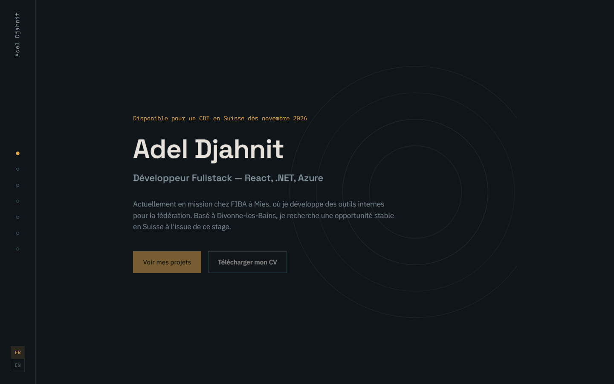

# Portfolio — Adel Djahnit

Site portfolio one-page, bilingue FR/EN, construit avec Next.js 14 (App
Router) et du CSS pur (pas de Tailwind, pas de framework CSS).



## Sections

- Projets phares (FIBA, Bonee, Kunagi) : contexte, ce que j'ai fait,
  résultat, lien vers le projet quand il est public
- Expérience : timeline
- Autres projets, avec lien vers le code
- Compétences : icônes cliquables vers le site officiel de chaque techno
- Recommandation : lettre de recommandation et diplôme, en image +
  téléchargement PDF
- Contact

Toggle FR/EN côté client (React state), sans dépendance à `localStorage`.

## Stack

- Next.js 14 (App Router), React 18, TypeScript
- CSS pur avec variables CSS (`app/globals.css`)
- Polices Google Fonts : Space Grotesk, IBM Plex Sans, IBM Plex Mono
  (via `next/font/google`)
- Icônes : `simple-icons` (logos de marque) + `react-icons` (fallback
  générique quand la marque n'a pas d'icône libre, ex. Azure)
- Pas de dépendance type framer-motion : l'animation d'entrée du hero
  est en CSS pur

## Démarrer en local

```bash
npm install
npm run dev
```

Le site est servi sur [http://localhost:3000](http://localhost:3000).

```bash
npm run build   # build de production + vérification des types
npm run start   # sert le build de production
```

## Structure du projet

```
app/
  layout.tsx        Layout racine, polices, métadonnées
  page.tsx           Assemblage de la page (une seule route)
  globals.css         Design system (couleurs, typo, layout, composants)
  providers.tsx       Provider du contexte de langue
components/
  Rail.tsx             Rail de navigation verticale + toggle FR/EN
  Hero.tsx             Section hero
  Projects.tsx         Projets phares
  Experience.tsx       Timeline d'expérience
  OtherProjects.tsx    Autres projets
  Skills.tsx           Compétences (icônes cliquables)
  Recommendation.tsx   Lettre de recommandation + diplôme
  Contact.tsx          Contact + pied de page
lib/
  content.ts             Contenu bilingue FR/EN + types (source unique de vérité)
  language-context.tsx   Contexte + hook useLanguage()
  skills.ts               Données des compétences (icônes, liens)
```

Le texte du site vit dans `lib/content.ts` (`content.fr` / `content.en`,
même forme typée pour les deux langues). `useLanguage()`
(`lib/language-context.tsx`) donne accès à la langue active et au
contenu déjà traduit, donc les composants de section n'ont pas de
logique de traduction à gérer.

## Déploiement sur Vercel (gratuit)

1. Ce dépôt est déjà sur GitHub — il suffit de le connecter.
2. Aller sur [vercel.com](https://vercel.com) et se connecter avec le
   compte GitHub.
3. Cliquer sur **Add New… → Project**, puis sélectionner ce dépôt.
4. Vercel détecte automatiquement Next.js — laisser les réglages par
   défaut (`Build Command: next build`, `Output Directory: .next`).
5. Cliquer sur **Deploy**.

Chaque `git push` sur la branche `main` déclenche ensuite un nouveau
déploiement automatique.

## À faire avant mise en ligne

- Remplacer le fichier placeholder `public/cv.pdf` par le vrai CV (le
  lien de téléchargement dans le hero et la section Contact pointe déjà
  vers `/cv.pdf`).
- Renseigner le vrai lien LinkedIn dans `lib/content.ts`
  (`contact.linkedinHref`, actuellement `#`).

## Contact

Adel Djahnit — adel.djahnit.pro@gmail.com
